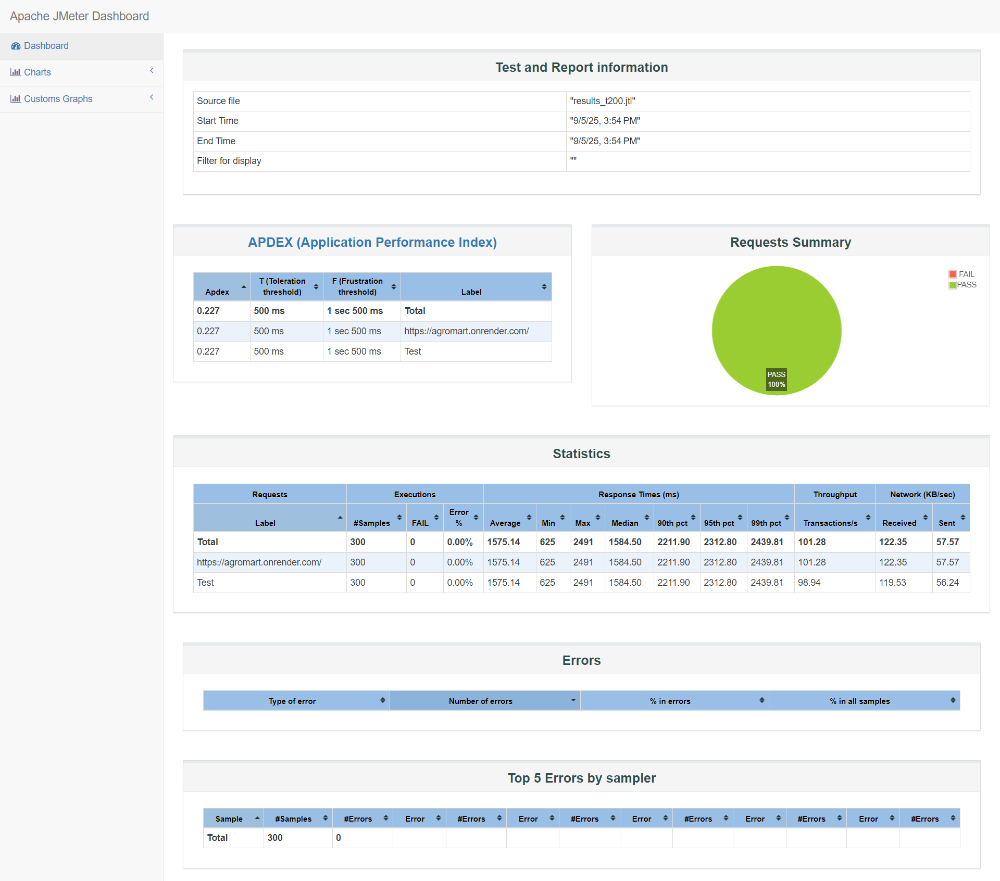

```markdown
# JMeter Performance Testing – AgroMart E-commerce Project

This repository demonstrates my **Apache JMeter** skills for performance testing. The tests were performed on **[AgroMart](https://agromart.onrender.com/)**, a **MERN stack-based e-commerce website** for the agriculture business.

---

## 🌐 Website Tested

**AgroMart** is an online platform for buying and selling agricultural products. The website is built using **MongoDB, Express.js, React.js, and Node.js (MERN stack)**, and allows users to:

- Browse and purchase agricultural products
- Manage their shopping cart
- Create and manage accounts
- Place and track orders

Performance testing ensures the website can handle multiple users and concurrent requests without slowing down.

---

## 📁 Project Structure

```

jmeter\_project/
│
├─ tests/                  # JMeter test plan files
│   ├─ agromart\_t100.jmx
│   ├─ agromart\_t200.jmx
│   └─ agromart\_t300.jmx
│
├─ results/                # JMeter results files (.jtl)
│   ├─ results\_t100.jtl
│   ├─ results\_t200.jtl
│   └─ results\_t300.jtl
│
├─ reports/                # HTML dashboards generated from JTL files
│   ├─ html\_report\_t100
│   ├─ html\_report\_t200
│   └─ html\_report\_t300
│
└─ images/                 # Screenshots of HTML reports
├─ T100.png
├─ T200.png
└─ T300.png

````

---

## ⚡ Test Scenarios

| Test Plan            | Threads | Description                    |
|----------------------|--------|--------------------------------|
| agromart_t100.jmx    | 100    | Basic load test                |
| agromart_t200.jmx    | 200    | Medium load scenario           |
| agromart_t300.jmx    | 300    | Heavy load scenario            |

---

## 📊 Sample HTML Reports

### T100 Threads


### T200 Threads


### T300 Threads


> Make sure to save your screenshots in the `images/` folder with the exact filenames above.

---

## 🚀 How to Run Tests

1. Make sure [Apache JMeter](https://jmeter.apache.org/) is installed.  
2. Open terminal/command prompt and navigate to the `tests` folder.  
3. Run tests in **non-GUI mode**:

```bash
jmeter -n -t agromart_t100.jmx -l ../results/results_t100.jtl
jmeter -n -t agromart_t200.jmx -l ../results/results_t200.jtl
jmeter -n -t agromart_t300.jmx -l ../results/results_t300.jtl
````

4. Generate **HTML dashboard reports**:

```bash
jmeter -g ../results/results_t100.jtl -o ../reports/html_report_t100
jmeter -g ../results/results_t200.jtl -o ../reports/html_report_t200
jmeter -g ../results/results_t300.jtl -o ../reports/html_report_t300
```

---

## 📌 Notes

* `.jmx` files are the main JMeter test plans.
* `.jtl` files contain raw results.
* HTML reports provide readable performance insights.
* Screenshots in `images/` folder illustrate performance dashboards.

---

## 💡 Skills Demonstrated

* Apache JMeter: Test planning, thread groups, listeners
* Load testing multiple scenarios (100, 200, 300 users)
* Generating and analyzing HTML dashboard reports
* Organizing projects for version control and GitHub showcase
* Performance testing a MERN stack-based e-commerce website

```

